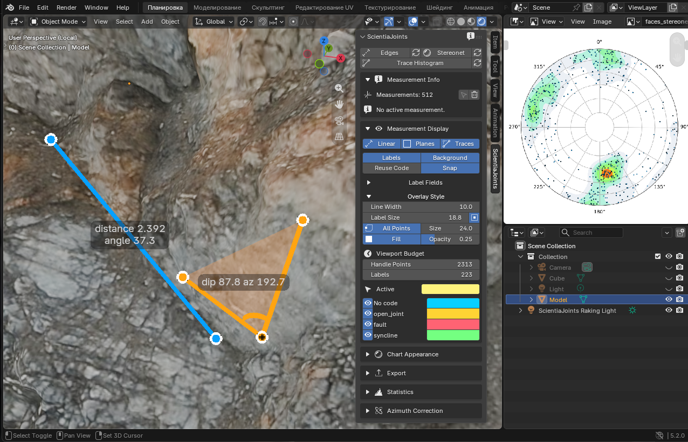

<p align="center">
  
</p>

<h1 align="center">ScientiaJoints</h1>

<p align="center">
  A Blender add-on for mapping rock mass fracturing: measurements on a 3D model,<br>
  statistics, stereonets and export.
</p>

<p align="center"><a href="README.ru.md">Русская версия</a></p>

---

ScientiaJoints is a Blender add-on for collecting fracture/joint measurements, exporting raw and processed data, and generating histograms and stereonets.



The add-on supports two measurement sources:

- Blender's standard Measure/Ruler annotations from `RulerData3D`.
- The built-in Scientia Measure, Scientia Polygon Plane and Scientia Trace toolbar tools,
  which store measurements in the `.blend` scene.

## Features

- Two-point linear measurements with distance, azimuth, dip, `dx`, `dy`, and `dz`.
- Three-point plane measurements with dip, corrected azimuth, area, and angle.
- Multi-point polygon plane measurements with best-fit dip/azimuth and boundary area.
- Open trace measurements along a fracture, scored by the summed length of their segments,
  with their own histogram and CSV export.
- Fracture codes with per-code color and visibility.
- `No code` group for uncoded measurements.
- CSV/TXT export with measurement metadata.
- Histogram and stereonet rendering.
- Chart dependencies bundled in the release archive, installable without internet access.
- Built-in diagnostics report with a self-test and detected problems.

## Installation

Two archives are published for every version. They install the chart packages
in different ways, so if one fails the other is the fallback.

### Extension build (recommended)

`ScientiaJoints-<version>-extension.zip` carries `matplotlib` and
`mplstereonet` as wheels inside the archive. Blender unpacks them itself: no
pip run, no package index, no proxy, and a short installation path.

1. Download the extension ZIP. Do not install a GitHub `Source code` archive.
2. Drag the ZIP into Blender, or use `Edit > Preferences > Get Extensions > Install from Disk`.

This is the build to use on a corporate network that blocks package indexes,
and the one to try first whenever the stereonet does not appear.

### Legacy add-on build

`ScientiaJoints-<version>.zip` installs through
`Edit > Preferences > Add-ons > Install from Disk`. Chart packages are
installed by the add-on itself: first from the wheels bundled in the archive
(no network needed), and only if that fails from PyPI.

The installation runs in the background, so Blender never freezes while
waiting for it. Progress and the result are shown in the ScientiaJoints panel.
A failed automatic attempt is retried at most once a day; the
`Install Chart Packages` button in the panel retries immediately. Set the
`SCIENTIAJOINTS_NO_AUTO_INSTALL` environment variable to disable the automatic
attempt entirely.

The release ZIP always contains `ScientiaJoints/__init__.py`. This internal directory name is required by Blender and remains valid even if the ZIP file itself is renamed. A ZIP whose root directory is named `ScientiaJoints 3`, `ScientiaJoints-main`, or another variation is not an installable release package.

### If charts do not appear

Open the diagnostics report with the small `i` icon in the ScientiaJoints panel
header. It names the exact cause and the action to take, and can be copied to
the clipboard for a support request. The most common causes are:

- **The packages were never installed.** The panel shows which ones are
  missing and offers the install button.
- **The Windows 260 character path limit.** `matplotlib` reads data files at
  import time; past that limit the files exist but cannot be opened, and the
  import fails with `FileNotFoundError`. The report shows how many characters
  each install directory has left. The extension build keeps the path short.
- **A second `numpy`.** Blender ships `numpy`; another copy installed next to
  it causes binary incompatibility errors in `matplotlib`. Neither build ships
  `numpy` into Blender's own interpreter, and pip installs pin it to the
  bundled version.
- **A network that blocks or inspects HTTPS.** The report distinguishes a
  certificate failure, a proxy rejection, a timeout, and an unreachable index.
  Use the extension build in that case.

If an earlier installation failed, or an update reports a missing name from `ScientiaJoints.operators`, perform a clean installation:

1. Close every Blender window. Updating an enabled add-on in the same Blender process can leave old Python submodules in memory.
2. Remove both folders if they exist:

   ```text
   %APPDATA%\Blender Foundation\Blender\5.1\scripts\addons\ScientiaJoints
   %APPDATA%\Blender Foundation\Blender\5.1\scripts\addons\ScientiaJoints 3
   ```

3. Start Blender and install the prepared release ZIP.

Do not unpack the release ZIP and do not rename folders inside it.

For manual installation, copy this repository directory as:

```text
<Blender user scripts>/addons/ScientiaJoints/__init__.py
```

### Building a Release

Requirements:

- Python 3.10 or newer. Blender is not required for packaging.
- A complete repository checkout, not an individual `__init__.py`.

Build procedure:

1. Set the version. There is one command for it, and it is the only supported
   way to change the number:

   ```powershell
   python tools\version.py 3.4.0
   ```

   The version lives in `blender_manifest.toml`. Blender reads `bl_info` out of
   `__init__.py` with `ast.literal_eval` before the add-on is ever imported, so
   that copy cannot be computed; the command writes both files, and
   `tools\build_release.py` refuses to package a checkout where they disagree.
   Run `python tools\version.py` with no argument to print the current version.
2. Add release notes to `CHANGELOG.md`.
3. Download the wheels that will be bundled. Run this with the **Blender**
   Python so the wheel tags match the Blender the release targets:

   ```powershell
   & 'E:\SteamLibrary\steamapps\common\Blender\5.2\python\bin\python.exe' tools\fetch_wheels.py --platform win_amd64 --python-version 3.13
   ```

   Add `--all-platforms` to produce an archive that installs on Windows, Linux
   and macOS. `wheels/` is not committed; it is rebuilt per release.

4. From the repository root, run the tests and compile checks:

   ```powershell
   python -m unittest discover -s tests -v
   python -m py_compile __init__.py dependencies.py diagnostics.py parser.py operators.py panel.py visualization.py scene_measurements.py custom_measure_tool.py domain\__init__.py domain\measurements.py domain\geometry.py application\__init__.py application\services.py infrastructure\__init__.py infrastructure\blender_annotations.py infrastructure\blender_scene_measurements.py infrastructure\exporters.py tools\build_release.py tools\build_tool_icons.py tools\fetch_wheels.py tools\version.py
   ```

5. Build both archives:

   ```powershell
   python tools\build_release.py
   ```

   This writes `dist/ScientiaJoints-<version>.zip` (legacy) and
   `dist/ScientiaJoints-<version>-extension.zip`, validates the package
   structure, Python syntax, required module API, and the manifest/wheel
   consistency, and prints SHA-256 checksums. Use `--format legacy` or
   `--format extension` to build only one.

6. Let Blender validate the extension archive:

   ```powershell
   & 'E:\SteamLibrary\steamapps\common\Blender\blender.exe' --command extension validate "dist\ScientiaJoints-$(python tools\version.py)-extension.zip"
   ```

7. Install both archives in a clean Blender profile before publishing. Point
   `BLENDER_USER_RESOURCES` at an empty directory with a **short** path to get
   an isolated profile.

The legacy archive keeps the `numpy` wheel, because `pip --target` resolves
dependencies without looking at what is already installed and would otherwise
fail offline. The extension archive drops it, because Blender ships `numpy`
and a second copy risks a binary incompatibility.

### Toolbar Icons

The two workspace tools draw their own toolbar icons from `icons/*.dat`.
Blender's toolbar does not take images: an icon is a list of flat-shaded
triangles on a 255×255 canvas, and `WorkSpaceTool.bl_icon` names the file to
load. The artwork is therefore described as vector shapes in
`tools/build_tool_icons.py` and rendered to triangles by it:

```powershell
python tools\build_tool_icons.py --preview preview.png
```

The `.dat` files are committed, so a normal build needs nothing; re-run the
script after changing the drawing code. `tests/test_tool_icons.py` fails if the
committed files no longer match it, if the format is corrupt, or if a tool
quietly fell back to the built-in ruler icon.

To reuse the artwork outside Blender - in a slide, a document, a README - export
it as PNG with a transparent background:

```powershell
python tools\build_tool_icons.py --png --png-size 1024
```

The files land in `icons/png/` and are not committed: they are regenerated from
the same source in one command, and a committed copy would only go stale.

### Reading rock structure in the viewport

`Chart Appearance > Blender View > Rock Inspection` switches every 3D view to
Rendered shading and lights the model for reading structure: a sun grazing the
surface at a low angle so fractures and steps fall into shadow, near-parallel
rays so a hairline fracture still casts one, no specular contribution so no
highlight sits over the texture, matte materials, and low ambient light so the
contrast survives. Press it again to restore the shading, world, material,
camera and render settings and to delete the light it added.

## Basic Workflow

1. Create measurements with Blender Measure/Ruler, `Scientia Measure`, or `Scientia Polygon Plane`.
2. Use `Measurement Info` to inspect the selected measurement and assign an existing or new code.
3. Use `Measurement Display` to set label fields, snap mode, code group colors, and visibility.
   `Overlay Style` inside it controls the line width, the label text size and
   whether a label sits at the centre of its measurement's area, whether point
   handles are drawn and how large they are, and the translucent fill on plane
   and polygon measurements together with its opacity. `Viewport Budget` at the
   bottom caps how many point handles and labels a redraw draws: on a scene with
   thousands of measurements those are what cost frame time, and the ones kept
   are the ones nearest the middle of the view. Raise them to see more at once,
   lower them if the viewport lags.
4. Use `Histogram` or `Stereonet` buttons at the top of the sidebar panel.
5. Use `Export` to write raw TXT or processed CSV files next to the saved `.blend` file.

Visibility switches (per code group, per layer, and the linear/plane toggles)
only affect the viewport. Every measurement is processed and exported
regardless of what is currently hidden.

### Notes on plane orientation

- Dip is the angle of the plane from horizontal; azimuth is the compass bearing
  of the steepest descent, clockwise from `+Y`. Both are verified against a
  NumPy reference to better than `1e-12` degrees.
- For a **vertical** plane the dip direction is ambiguous by 180 degrees, which
  is a property of the measurement, not of the add-on. Above about 89 degrees
  of dip, two traces of the same fracture can report azimuths 180 degrees
  apart. Take that into account when clustering sub-vertical joint sets. Below
  89 degrees the result is fully stable.
- A polygon whose points lie on one straight line, or coincide, cannot define
  an orientation. Such measurements are marked `Orientation is arbitrary` in
  `Measurement Info`, counted in Statistics, listed by name in the diagnostics
  report, and carry a reason in the `degeneracy` column of the faces CSV.

## Development Checks

Run from the add-on folder:

```powershell
python -m unittest discover -s tests -v
python -m py_compile __init__.py dependencies.py parser.py operators.py panel.py visualization.py scene_measurements.py custom_measure_tool.py domain\__init__.py domain\measurements.py domain\geometry.py application\__init__.py application\services.py infrastructure\__init__.py infrastructure\blender_annotations.py infrastructure\blender_scene_measurements.py infrastructure\exporters.py tools\build_release.py tools\build_tool_icons.py tools\version.py
```

Optional Blender smoke test:

```powershell
& 'E:\SteamLibrary\steamapps\common\Blender\blender.exe' --background --factory-startup --python-expr "import sys; sys.path.insert(0, r'C:\Users\Wismut\AppData\Roaming\Blender Foundation\Blender\5.1\scripts\addons'); import addon_utils, bpy; addon_utils.enable('ScientiaJoints', default_set=False, persistent=False); assert hasattr(bpy.ops.export, 'raw_edges'); addon_utils.disable('ScientiaJoints', default_set=False); print('SCIENTIAJOINTS_SMOKE_OK')"
```

## Changelog

See [CHANGELOG.md](CHANGELOG.md) for changes since the original 2.2 baseline.

## Publication Note

Choose and add a license before publishing the repository publicly.
